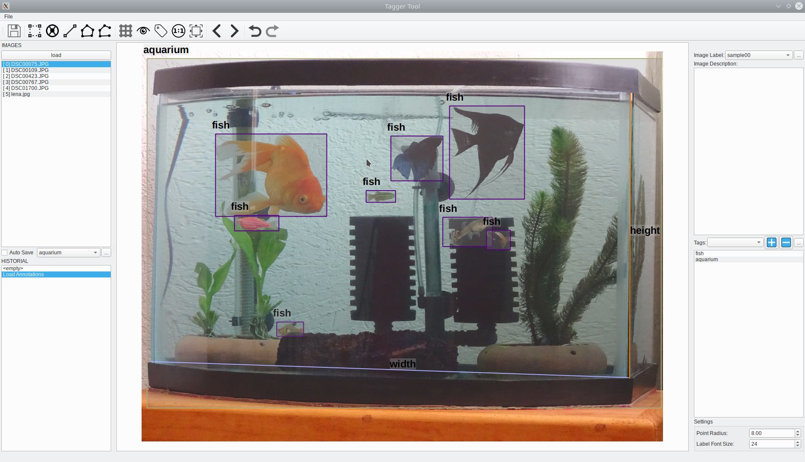

# TaggerTool 
This is a very simple tool for viewing/editing visual annotations on images. Supports **BoundingBoxes**, **Polygons**, **LineStrips**, **Points** and **Lines**

## Annotation format

TaggerTool uses JSON format for annotations. To each `image_name.jpg` corresponds the `image_name.json` annotation file. Annotations and images can be in the same folder or in separate folders. 

### Annotation json format/schema: 
```json  
{
  "description": "Annotation Example",
  "image_h": 1536,
  "image_name": "DSC00767.JPG",
  "image_w": 2048,
  "label": "sample00",
  "bboxes": [
    {
      "crowded": false, "label": "cat", "occluded": false, "truncated": false,
      "x1": 369.54, "x2": 452.2, "y1": 638.587, "y2": 709.77
    }
  ],
  "line_strips": [
    {
      "label": "line_strip1",
      "x_coords": [800.82, 1046.8, 1153.647],                        
      "y_coords": [548.5, 728.6, 588.33]
    }
  ],
  "lines": [
    {
      "label": "line1",
      "x1": 502.49, "x2": 671.0, "y1": 631.2, "y2": 703
    }
  ],
  "points": [
    {"label": "pt", "x": 709.7, "y": 857.38},
    {"label": "pt", "x": 577.8, "y": 865.75}
  ],
  "polygons": [
    {
      "label": "poly1",
      "x_coords": [674.18, 976.0, 951.59, 921.5, 882.50],
      "y_coords": [734.0, 780.5, 839.58, 882.50, 908.675]
    }
  ],
  "tags": ["person","animal"]
}
``` 
Use scripts [coco_convert.py](py_tools/coco_convert.py) and [pascal_convert.py](py_tools/pascal_convert.py) to convert annotation from [COCO](https://cocodataset.org/#home) and [PASCAL](http://host.robots.ox.ac.uk/pascal/VOC/) formats. You can export annotations to COCO and PASCAL formats directly from TaggerTool

## How to use?

### Some shortcuts:
* *a* : add new **BBox** 
* *w* : add new **Polygon**
* *q* : add new **Line** 
* *x* : add new **LineStrip**
* *z* : add new **Point** 
* *g* : show/hide grid 
* *l* : show/hide labels 
* **Ctrl +** mouse scroll wheel* : zoom in/out image  
* **Shift +** left click* : enable/disable item 
* **Meta + left click** or **Alt + left click**: add or remove polygons nodes
* **Ctrl + E**: open Exporter dialog  

### See this simple [demo](https://www.youtube.com/watch?v=QozIy9p6gbM): 



## How to compile?
Use QtCreator to compile. 


