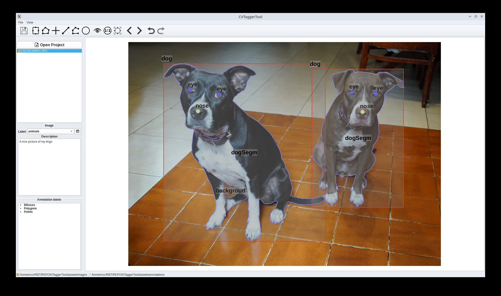

# CVTaggerTool



CVTaggerTool is a simple, lightweight **computer vision annotation tool** built with Qt 6.  
It supports the most common annotation types used in CV datasets:

- Bounding Boxes  
- Polygons  
- Points  
- Lines, Line Strips  
- Circles  

The goal of this project is to provide an **easy-to-use, dependency-light alternative** to existing heavy annotation tools. Because it is a pure Qt app, it integrates well into Linux/Window/Mac  without requiring complex runtime environments.


## Usage

- **Open a project**: set the *image* and *annotation* folders, then click the **Open Project** button.  
- **Add annotations**: use the corresponding icons in the toolbar.  
- **Handy shortcuts**:
  - **Lock / Unlock item** → `Shift + Right Click`
  - **Open edit dialog** → `Left Click` on an unlocked item
  - **Zoom in/out** → `Mouse Scroll`
  - **Pan image** → `Ctrl + Right Mouse Drag`
  - **Cycle selection** (when items overlap) → `Ctrl + Shift + Right Click`


## Features

- Create and edit multiple annotation types  
- Lock/unlock items to prevent accidental edits  
- Export annotations to:
  - **Native JSON format** (one file per image)
  - **COCO JSON** dataset format
  - **YOLO (Ultralytics)** text format  
- Undo/redo with `QUndoStack`  
- Cross-platform (Linux, Windows, macOS [not tested])
- Ready to use executables here for [Window 11](link here) and Linux (link here)


## License

This project is released under the [MIT License](https://opensource.org/licenses/MIT).  
See the [LICENSE](LICENSE) file for the full text.

## Requirements

- **Qt 6.5+** (tested with 6.9)  
- CMake 3.16+  
- A C++17 (or later) compiler (GCC, Clang, MSVC all supported)


## Building

```bash
git clone https://github.com/yourname/cvtaggertool.git
```
Open `cvtaggertool/src/CMakeLists.txt` with QtCreator and compile it.

This produces the `TaggerTool` binary inside the build folder.

## Usage

```bash
./TaggerTool
```


## Contributing

Contributions are welcome!
Please open issues or pull requests on the GitHub repository.


## Acknowledgements
 - Built with Qt
 - COCO export based on the official dataset specification
 - YOLO export compatible with Ultralytics